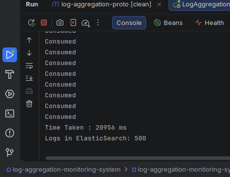
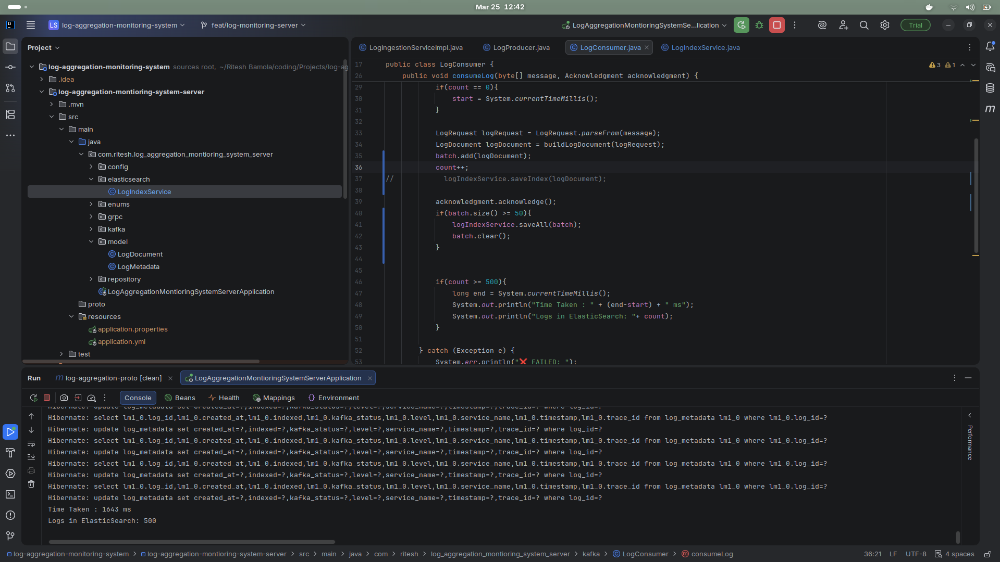
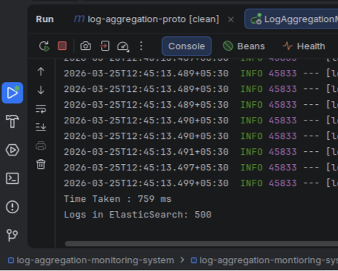

# 📊 Log Aggregation & Monitoring System

A scalable backend system designed to **collect, process, and monitor logs in real-time** using modern distributed technologies like **Kafka, gRPC, and Elasticsearch**.

---

## 🚀 Features

* 📥 High-throughput log ingestion via **gRPC**
* Unary RPC: `LogService.IngestLog(LogRequest) -> LogResponse`
* Client-streaming RPC: `LogService.BulkIngest(stream LogRequest) -> LogSummary`
* 🧵 Asynchronous decoupling using **Apache Kafka**
* Kafka topic: `my_topic` (message key: `logId`)
* Kafka consumer group: `group_id`
* ⚡ High-throughput processing
* Kafka listener container concurrency: `3`
* Batching: flush to Elasticsearch when `batch.size() >= 50`
* 💾 Metadata persistence using **PostgreSQL (Hibernate/JPA)**
* Table: `log_metadata`
* Tracks `kafkaStatus` as `PENDING / SENT / FAILED`
* 🔎 Indexing readiness using **Elasticsearch**
* Elasticsearch index: `logs`
* Document mapping is defined in `LogDocument`
* 📊 Interview-ready performance story: README includes measured baseline vs batch vs concurrent runs

---

## 🏗️ Architecture


**Flow:**

* `LogService.IngestLog` / `LogService.BulkIngest` (gRPC) receive a `LogRequest`
* The server saves `LogMetadata` into PostgreSQL table `log_metadata` (`indexed=false`, `kafkaStatus=PENDING`)
* gRPC publishes the log bytes to Kafka topic `logs.ingestion` (key: `logId`)
* Kafka consumer (group `log-consumer`) batches messages (batch size `50`) and indexes into Elasticsearch index `logs`
* Note: the current code tracks `kafkaStatus` (SENT/FAILED) but does not flip `indexed=true` after Elasticsearch indexing

---

## 🧩 gRPC API

* Service: `LogService`
* `IngestLog(LogRequest) returns (LogResponse)` (single request)
* `BulkIngest(stream LogRequest) returns (LogSummary)` (client-streaming)
* `LogRequest` fields: `log_id`, `level`, `service_name`, `trace_id`, `message`, `timestamp`
* Server behavior: if `timestamp` is blank, it uses `Instant.now()`

---

## 🛠️ Tech Stack

* Java (Spring Boot)
* Spring gRPC
* Protocol Buffers
* Apache Kafka
* PostgreSQL (Spring Data JPA / Hibernate)
* Elasticsearch

---

## 📂 Project Structure

```bash
log-aggregation-monitoring-system/
├── images/
├── log-aggregation-proto/
│   └── src/main/proto/log_aggregation.proto
└── log-aggregation-montioring-system-server/
    ├── pom.xml
    └── src/main/java/com/ritesh/log_aggregation_montioring_system_server/
        ├── grpc/
        ├── kafka/
        ├── elasticsearch/
        ├── model/
        ├── repository/
        └── config/
```

---

## ⚙️ Setup & Run

### 1. Start Dependencies
* Kafka broker at `localhost:9092` (Zookeeper depends on your Kafka setup)
* Elasticsearch (typically `http://localhost:9200`, unless configured)
* PostgreSQL configured for JPA entity `log_metadata`

### 2. Build & Run

```bash
cd "log-aggregation-proto" && ./mvnw -q clean package
cd "../log-aggregation-montioring-system-server" && ./mvnw spring-boot:run
```

> Note:
> * Kafka topic/group and bootstrap server are currently hard-coded (`my_topic`, `group_id`, `localhost:9092`).
> * Add `application.yml` or `application.properties` inside `log-aggregation-montioring-system-server/` for Elasticsearch + PostgreSQL connection settings.

---

## 🧪 Test Cases (Step-by-Step Optimization)

---

### ✅ 1. Normal Processing Test (Baseline)



**Description:**

* Intended baseline: per-log indexing
* In this repo, per-log indexing is disabled and batching is used (`batch.size() >= 50`)

**Result:**

* Total Logs: `500`
* Time Taken: `~20956 ms`

**Observation:**

* ❌ Very slow due to **individual Elasticsearch writes**
* ❌ High I/O overhead

---

### 📦 2. Batch Processing Test (Optimization Step 1)



**Logic:**

```java
if(batch.size() >= 50){
    logIndexService.saveAll(batch);
    batch.clear();
}
```

**Description:**

* Logs are grouped into batches before indexing
* Reduces number of calls to Elasticsearch

**Result:**

* Total Logs: `500`
* Time Taken: `~1643 ms`

**Observation:**

* ✅ Massive improvement over normal processing
* ✅ Reduced I/O operations
* ⚖️ Balanced performance and resource usage

---

### ⚡ 3. Concurrent Processing Test (Optimization Step 2)



**Configuration:**

```java
factory.setConcurrency(3);
```

**Description:**

* Multiple Kafka consumers process logs in parallel
* Works best when combined with batching

**Result:**

* Total Logs: `500`
* Time Taken: `~759 ms`

**Observation:**

* 🚀 Fastest approach
* ✅ Parallel processing boosts throughput
* ✅ Ideal for production-scale systems

---

## 📊 Performance Comparison

| Step | Test Type  | Time Taken | Improvement            |
| ---- | ---------- | ---------- | ---------------------- |
| 1    | Normal     | ~20956 ms  | Baseline               |
| 2    | Batch      | ~1643 ms   | 🔥 Huge improvement    |
| 3    | Concurrent | ~759 ms    | 🚀 Maximum performance |

---

## 🔥 Key Learnings

* Start with **baseline (normal processing)**
* Add **batching → reduces I/O bottleneck**
* Add **concurrency → maximizes throughput**
* Best production setup:

  * ✅ Batch + Concurrency combined

---

## 📌 Future Improvements

* Add **Retry mechanism & Dead Letter Queue (DLQ)**
* Integrate **Kibana/Grafana dashboards**
* Implement **Backpressure handling**
* Add **Monitoring & alerting system**

---

## 👨‍💻 Author

Ritesh Bamola

---

## ⭐ Contribution

Feel free to fork, improve, and contribute 🚀
